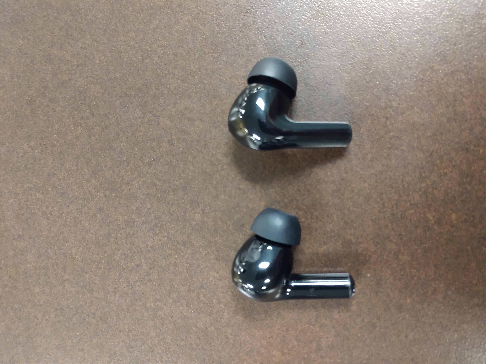

# The Earbuds I Despise
## Usability Journal Entry 1
About a year ago I purchased a pair of cheap wireless earbuds. I bought them to use with Youtube while I do chores around my house, specifically while doing dishes. After a few months of usage I began to notice design issues that harmed the usability of the product. The case of the earbuds is a sleek black plastic with no visible buttons. At first glance these earbuds are a simple design that have no external controls. Despite this the back of the earbuds have touch buttons that have various controls. There are no markings on the case that indicate the presence or function of the buttons. Furthermore because of their location and high sensitivity the buttons are very easy to accidentally press. 
Since I lost the user manual for them I had to experiment to know their exact usage but the buttons seem to control a few things. The buttons can pause the Youtube video, move ahead in a playlist, and activate Google's voice control feature on my phone. Since I do not have Google's voice control enabled on my phone, pressing that specific button will open a pop up asking me to enable it which I can only shut down by going to my phone and doing so manually. These controls are mapped to button presses of varying time and repetitions. A single press will pause the video, a single press and hold will activate Google's voice control, a quick double press will move ahead or backwards in the playlist corresponding to which earbud is pressed; left for backwards right for forwards.

### The Culprits

I have several issues with the design of these earbuds. 

**Poor Affordance**
  - Nowhere in the design of this product is there any indication that the buttons exist. Affordances are the characteristics or properties of an object that suggest how it can be used. This design presents no affordances of the three controls it offers. If the buttons were tactile buttons that could be felt it would be obvious that the earbuds have additional features.
    
**No Natural Mapping**
  - Natural mapping refers to a design in which the system's controls represent or correspond to the desired outcome. The buttons on the earbuds don't naturally map well to their desired function. One button for three functions is confusing, instead having three distinct buttons would be helpful. Small indicators on the buttons that show a pause symbol, Google's logo, and arrow indicators would properly demonstrate the intended function.

**Error Prone**
  - Error prevention is an important aspect of design and these earbuds do little to prevent errors. Errors include user mistakes as well as software malfunctions; anything that causes an undesired result is an error. Due to the poor affordance of the buttons, it is very easy to accidentally mispress the buttons and accidentally pause your video. Additionally, due to the location of the buttons it is especially easy to mispress when you're trying to remove the earbuds from your ears. Making the buttons less sensitive would prevent many of the errors I've had using these earbuds.
